# Monitor LibreChat — Manual do Usuário

_🇺🇸 [English version](MANUAL.md) · 🛠️ [Manual técnico](TECHNICAL_MANUAL.pt-BR.md)_

Guia completo de todas as telas do painel de monitoramento e auditoria para uma
instância corporativa do LibreChat — adoção, uso, custo e um detector de segurança em
modo sombra, tudo em um único painel.

> As capturas de tela deste manual foram feitas em uma instância rodando com **dados de
> exemplo (sintéticos)** — por isso todas as telas trazem o aviso amarelo "Exibindo
> dados de exemplo". Os números mudam quando conectado a um LibreChat real, mas as telas
> e o comportamento são idênticos.

## Sumário

1. [Visão geral](#1-visão-geral)
2. [Como acessar](#2-como-acessar)
3. [Navegação geral](#3-navegação-geral)
4. [Dashboard Executivo](#4-dashboard-executivo)
5. [Adoção](#5-adoção)
6. [Custos](#6-custos)
7. [Casos de Uso](#7-casos-de-uso)
8. [Maturidade](#8-maturidade)
9. [Segurança & Risco](#9-segurança--risco)
10. [Alertas / Casos](#10-alertas--casos)
11. [Políticas](#11-políticas)
12. [Recursos Autorizados](#12-recursos-autorizados)
13. [Auditoria](#13-auditoria)
14. [Configurações](#14-configurações)
15. [Status Operacional](#15-status-operacional)
16. [Integrações opcionais](#16-integrações-opcionais)
17. [Perguntas frequentes](#17-perguntas-frequentes)

## 1. Visão geral

O Monitor LibreChat é um painel independente que lê o próprio banco de dados do
LibreChat e mostra, em um só lugar, o que hoje está espalhado ou simplesmente não
existe: quem usa a ferramenta, quanto isso custa e se algum uso foge do esperado.

**O que mostra:** adoção, uso de tokens, custo, casos de uso por Agent, maturidade de
IA, detecções de segurança, políticas, recursos autorizados, auditoria e a saúde do
próprio sistema.

**O que NÃO faz:** não bloqueia nada. Não intercepta prompts. É estritamente
observacional — lê o banco depois que a conversa já aconteceu.

**De onde vêm os dados:** direto do MongoDB do LibreChat, através de um usuário
dedicado de somente leitura. Sem essa conexão, o painel mostra dados de exemplo
claramente identificados.

## 2. Como acessar

O acesso é feito com um usuário e senha únicos, definidos por quem administra o Monitor
(não é o mesmo login do LibreChat). Não existem perfis diferentes de acesso nesta
versão — quem entra, vê tudo.

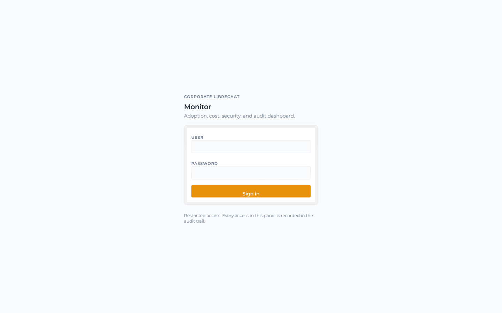
_A tela de login. O aviso no rodapé existe porque todo acesso a este painel é
registrado na trilha de auditoria (seção 13)._

1. Abra o endereço do Monitor fornecido por quem administra o sistema.
2. Informe **Usuário** e **Senha**.
3. Clique em **Entrar**. Após oito horas sem uso, a sessão expira e é preciso entrar
   novamente.

> Depois de várias tentativas de senha incorreta seguidas, o sistema passa a recusar
> novas tentativas por alguns minutos, mesmo que a senha esteja certa. Isso é
> proposital — espere um pouco e tente de novo.

## 3. Navegação geral

Depois de entrar, três elementos aparecem em toda tela do painel:

**Menu lateral** — organizado por finalidade, não por ordem alfabética: **Visão geral**
(o dia a dia — dashboard, adoção, custos), **Governança** (segurança, políticas,
alertas) e **Plataforma** (auditoria, configurações, status). Pode ser recolhido pelo
botão "Recolher" no rodapé do menu, para ganhar espaço de tela.

**Idioma** — os botões **EN** / **PT** no topo trocam o idioma da interface
instantaneamente, sem recarregar a página. A escolha fica salva no navegador — da
próxima vez que abrir o Monitor, ele lembra.

**Atualização automática** — todo o painel se atualiza sozinho a cada **60 segundos** —
o indicador "Atualizado há Ns" no Dashboard mostra o tempo desde a última atualização.
Não é preciso recarregar a página manualmente.

> A maioria das telas tem um seletor de período (De / até, ou atalhos como 7d / 30d /
> 90d). O período escolhido afeta os números daquela tela e fica só nela — mudar o
> período em Custos não muda o período do Dashboard.

## 4. Dashboard Executivo

A primeira tela depois de entrar. Reúne os números mais importantes em um só lugar,
para uma leitura rápida do estado geral do uso de IA na organização.

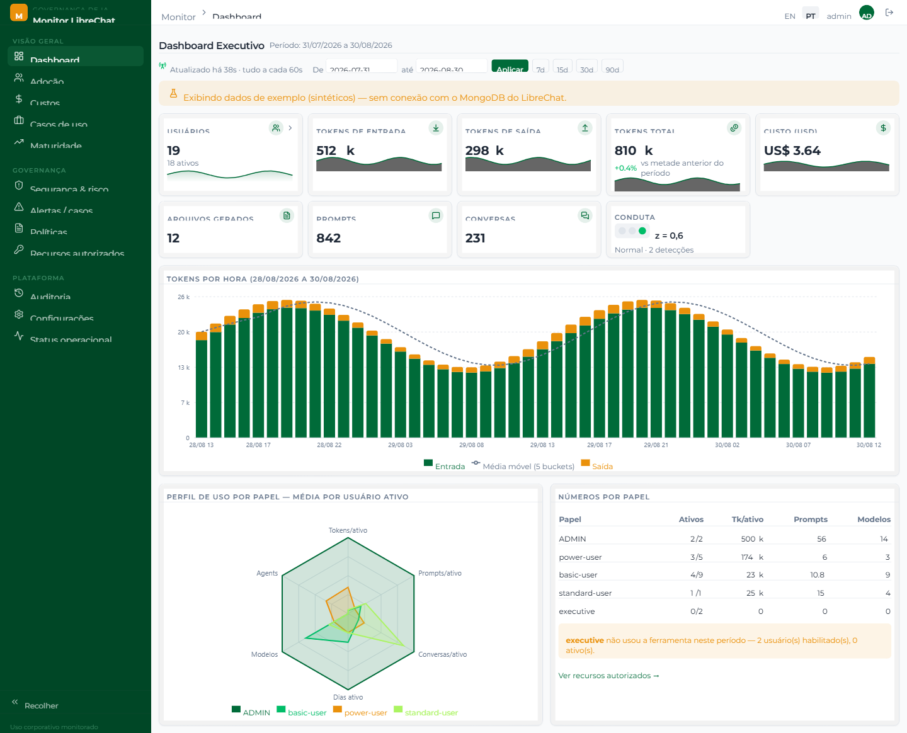
_Dashboard Executivo com dados de exemplo. Os cards do topo, o gráfico de tokens por
hora, o radar por papel e a tabela de números por papel._

### Os cards

| Card                                       | O que significa                                                                                                                                                            |
| ------------------------------------------ | -------------------------------------------------------------------------------------------------------------------------------------------------------------------------- |
| **Usuários**                               | Total de usuários habilitados e quantos estiveram ativos no período. Clicável — abre a lista completa de usuários.                                                         |
| **Tokens de entrada / saída / total**      | Volume de tokens consumidos (o que foi enviado ao modelo e o que ele respondeu).                                                                                           |
| **Custo (USD)**                            | Custo estimado do período, sempre em dólares. Ver a seção Custos para como esse número é calculado.                                                                        |
| **Arquivos gerados / Prompts / Conversas** | Volume de uso bruto no período.                                                                                                                                            |
| **Conduta**                                | Indicador estatístico (não é uma regra fixa) que compara o consumo mais recente contra a média histórica. Clicável — abre o detalhe das detecções de segurança do período. |

### Cards clicáveis

Dois cards abrem uma janela com mais detalhe ao serem clicados:

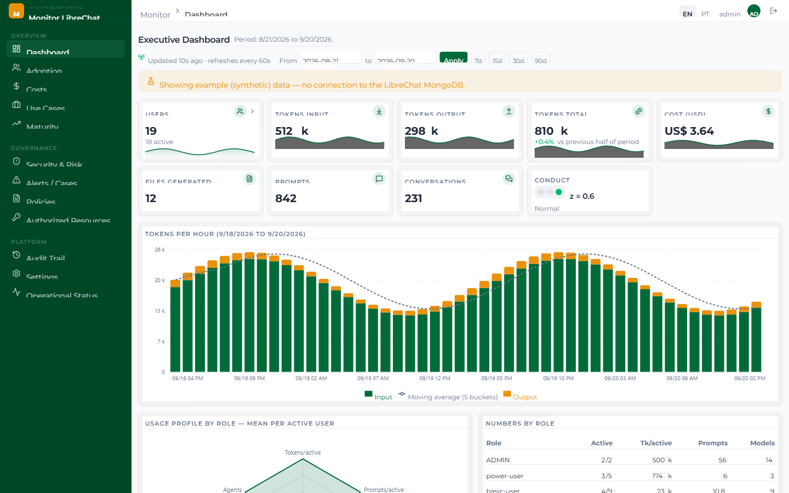
_Clicar no card "Usuários" abre a lista completa, ordenada pelo acesso mais recente —
com status (ativo/inativo), papel, tokens consumidos e data do último acesso._

> "Último acesso" é a data mais recente entre o login e o uso efetivo da ferramenta.
> Isso existe porque a sessão do LibreChat dura 7 dias e não se renova a cada acesso —
> usar só o login deixaria essa informação desatualizada.

### Gráfico de tokens por hora

Mostra entrada, saída e uma média móvel (suaviza picos isolados) ao longo do tempo. A
largura do intervalo (por hora, a cada 6h ou por dia) se ajusta sozinha conforme o
período selecionado, para o gráfico nunca virar uma parede de barras minúsculas.

### Radar e tabela por papel

O gráfico de radar compara o perfil de uso entre papéis (tokens, prompts, conversas,
dias ativos, modelos e Agents distintos — tudo normalizado por usuário _ativo_, não
pelo total de usuários, para não confundir "papel pequeno" com "papel que usa pouco").
A tabela ao lado traz os mesmos números em formato de lista, com avisos quando um papel
não usou a ferramenta no período ou acessou modelos fora da allowlist configurada.

## 5. Adoção

Quantas pessoas de fato usam a ferramenta, e com que frequência — separado do volume de
uso (que fica no Dashboard e em Custos).

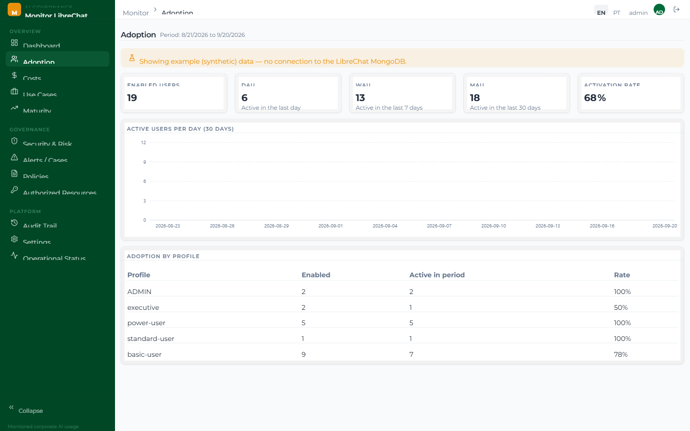
_DAU, WAU, MAU, taxa de ativação, uma série de usuários ativos por dia e adoção por
papel._

- **DAU / WAU / MAU** — usuários com consumo real (não apenas login) no último dia,
  últimos 7 dias e últimos 30 dias — janelas fixas, independentes do período selecionado
  na tela.
- **Taxa de ativação** — percentual dos usuários habilitados que efetivamente usaram a
  ferramenta no período selecionado.
- **Adoção por papel** — quantos usuários de cada papel estão habilitados versus
  quantos estiveram ativos — mostra rapidamente onde a adoção está baixa.

## 6. Custos

Quanto o uso de IA custou no período, aberto por papel, modelo e área.

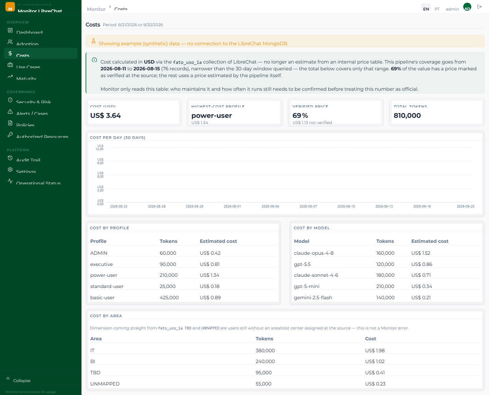
_Custo total, papel de maior custo, percentual de preço verificado, custo por dia, por
papel, por modelo e por área._

### Dois jeitos de calcular o custo

Esta é a única tela do Monitor cujo comportamento muda dependendo da configuração do
ambiente — vale entender os dois modos:

| Modo                    | Quando aparece                                                           | O que significa                                                                                                                                                                        |
| ----------------------- | ------------------------------------------------------------------------ | -------------------------------------------------------------------------------------------------------------------------------------------------------------------------------------- |
| **Pipeline verificado** | Quando o ambiente tem sua própria coleção de rateio de custo configurada | Custo real em dólares, com uma flag de "preço verificado" separando o que veio de uma fonte confirmada do que ainda é estimativa dessa mesma fonte.                                    |
| **Estimativa**          | Padrão — sem coleção de custo configurada                                | Custo calculado a partir da contagem real de tokens multiplicada por uma tabela de preços interna (aproximada, sujeita a revisão). Ainda é dado real — só o valor em dólar é estimado. |

A tela sempre avisa, logo abaixo do título, qual dos dois modos está ativo naquele
momento — não é preciso adivinhar.

> "Custo por área" só aparece quando o pipeline verificado está configurado, porque
> área/centro de custo não é algo que o LibreChat guarda nativamente — só existe se uma
> fonte externa fornecer essa informação. Ver seção 16 (Integrações opcionais).

## 7. Casos de Uso

Para que a IA está sendo usada — hoje, medido de forma indireta, através do Agent
corporativo utilizado.

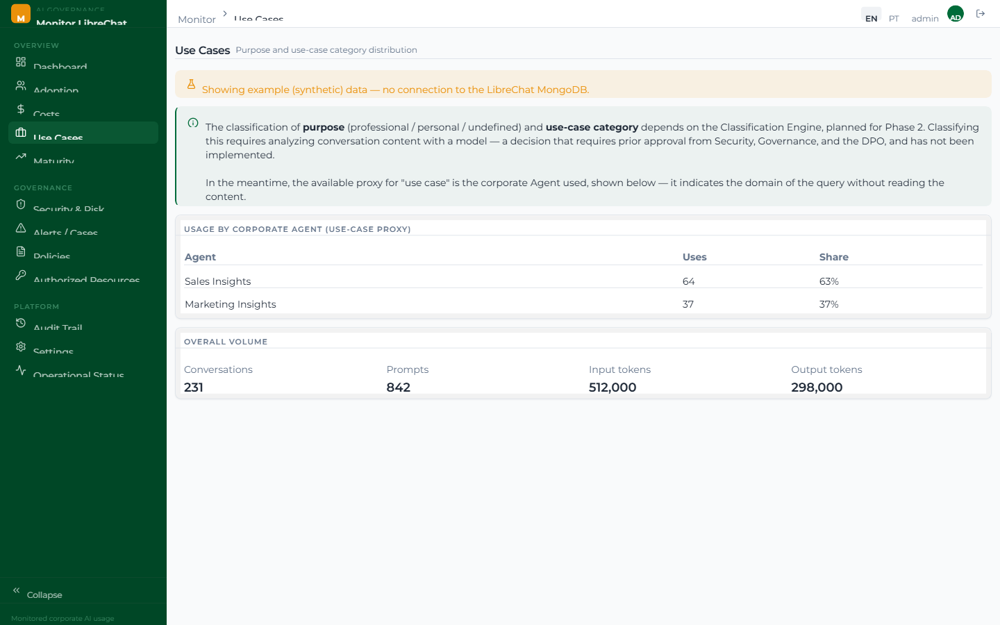
_Uso por Agent corporativo (como proxy de "caso de uso") e volume geral de conversas,
prompts e tokens._

> Classificar o propósito real de cada conversa (profissional, pessoal, por categoria)
> exigiria analisar o conteúdo das mensagens com um modelo de IA — uma decisão que
> precisa de aprovação prévia de Segurança, Governança e do responsável por privacidade
> de dados, e que esta versão do Monitor não implementa. Por isso, o Agent usado é o
> melhor proxy disponível hoje: indica a área da consulta sem precisar ler o conteúdo.

## 8. Maturidade

Um modelo de referência para avaliar a maturidade da adoção de IA na organização —
hoje, documental: os critérios e níveis estão definidos, mas o cálculo automático de
pontuação ainda não está implementado.

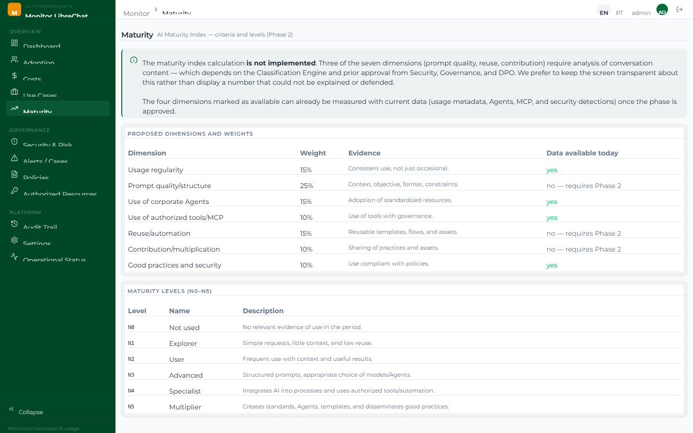
_As sete dimensões propostas (com peso e evidência esperada) e os seis níveis de
maturidade, de "Não utilizado" a "Multiplicador"._

A tela é transparente sobre a limitação: mostrar um número calculado sem que os
critérios estejam realmente medidos seria pior do que não mostrar nada.

## 9. Segurança & Risco

O detector de segurança do Monitor, rodando em **modo sombra**: detecta e registra, mas
nunca bloqueia nada.

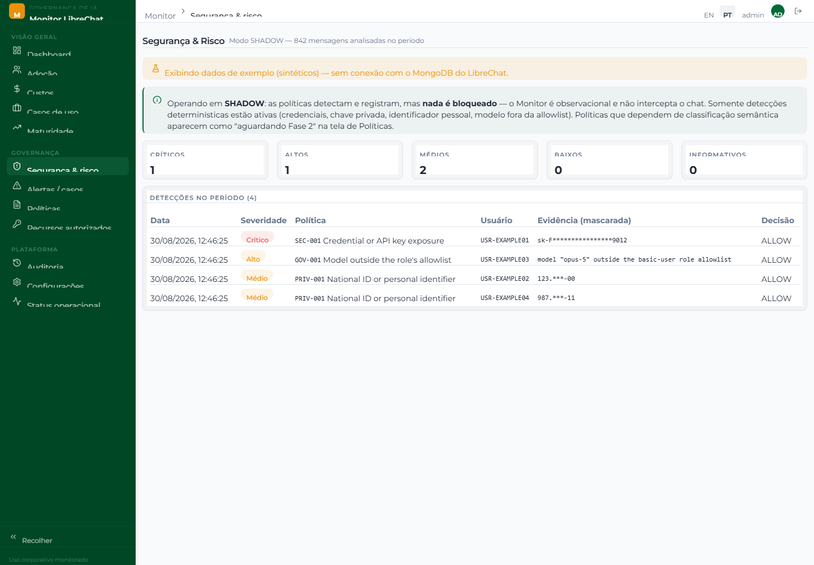
_Contagem de detecções por severidade e a lista de detecções do período, com evidência
sempre mascarada._

### O que é detectado hoje

Cinco políticas rodam de fato, todas por reconhecimento de padrão local — nenhum
conteúdo é enviado a um modelo de IA para essa análise, e nada do texto original é
guardado:

- **Exposição de credencial ou chave de API**
- **Senha ou token explícito na conversa**
- **Material de chave privada**
- **Identificador pessoal** (padrão de documento nacional)
- **Uso de modelo fora da allowlist do papel** (comparado contra a configuração real do
  LibreChat)

O restante do catálogo (ver seção 11, Políticas) está registrado para rastreabilidade,
mas ainda não produz detecção — depende de classificação semântica de conteúdo, que é
uma fase futura.

> Nenhuma política está em modo de bloqueio (enforcement). Todas as decisões na coluna
> "Decisão" aparecem como `ALLOW` — o Monitor está observando, não interceptando.

## 10. Alertas / Casos

As mesmas detecções da tela de Segurança, apresentadas como um painel de alertas
filtrável — feito para investigação caso a caso.

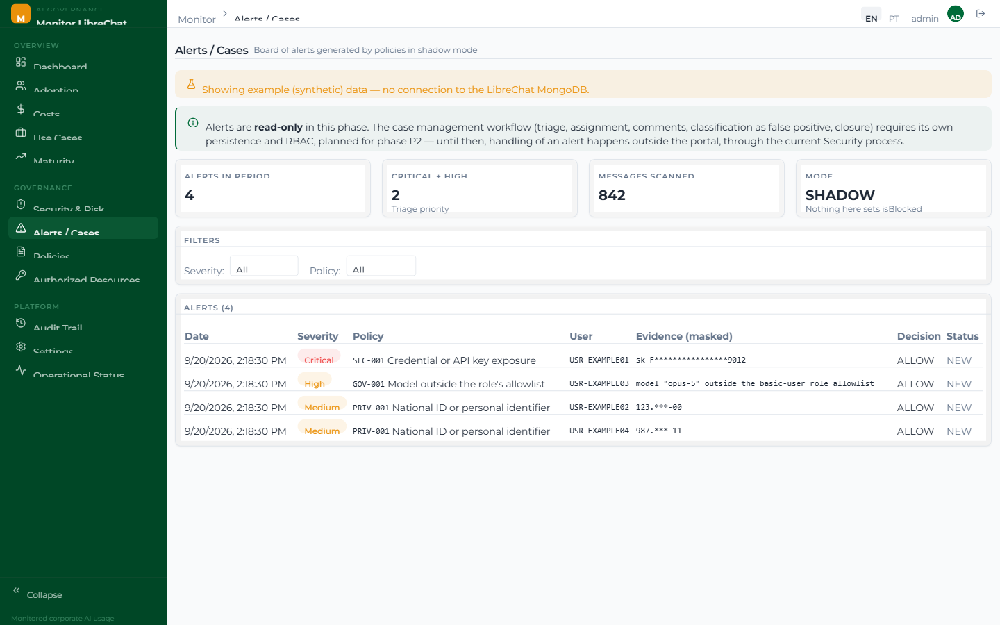
_Filtros por severidade e por política, e a tabela de alertas com status._

Esta tela é somente leitura nesta versão — um fluxo completo de triagem (assumir um
caso, marcar como falso positivo, encerrar) exigiria seu próprio controle de acesso e
ainda não está implementado. Por enquanto, o tratamento de um alerta acontece fora do
painel, pelo processo de segurança já existente na organização.

## 11. Políticas

O catálogo completo de políticas de governança de IA planejadas, versionado como
arquivo — não como registro de banco de dados.

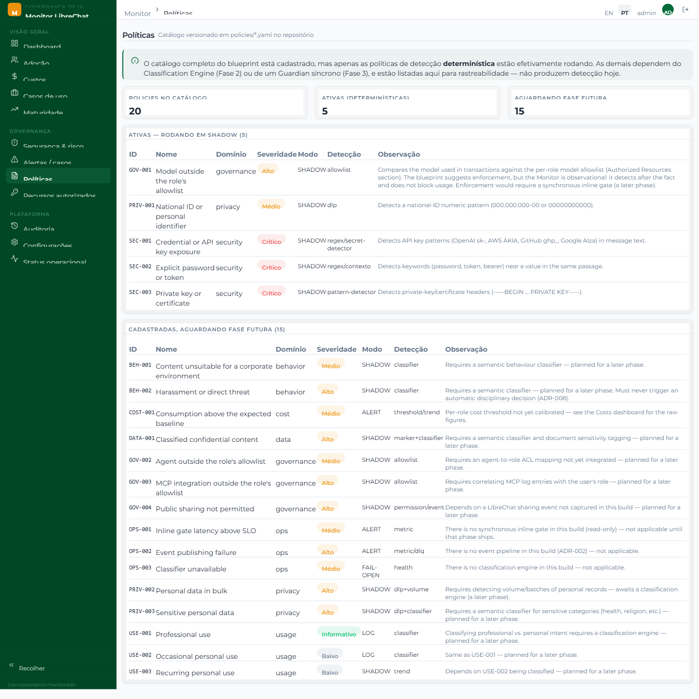
_Catálogo de 20 políticas: as que de fato rodam (modo sombra) e as que aguardam uma
fase futura._

> Cada política vive em seu próprio arquivo `policy.yaml` dentro da pasta de políticas.
> Adicionar ou ajustar uma política é editar esse arquivo — não é preciso alterar
> código nem recompilar nada.

## 12. Recursos Autorizados

Quais modelos, Agents e integrações cada papel pode usar — a referência com a qual a
política "modelo fora da allowlist" compara.

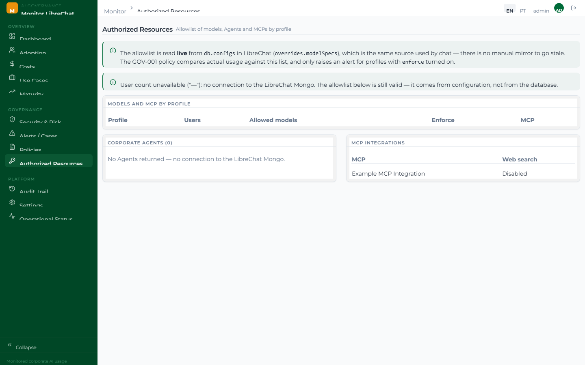
_Allowlist de modelos por papel (lida ao vivo da configuração do próprio LibreChat),
Agents corporativos e integrações MCP._

A allowlist de modelos não é um cadastro próprio do Monitor — ela é lida diretamente da
configuração do LibreChat, a mesma fonte que o chat usa. Isso evita que o painel fique
com uma cópia desatualizada assim que alguém muda a configuração pelo próprio
LibreChat.

## 13. Auditoria

Duas trilhas de auditoria distintas, na mesma tela: quem acessou o próprio Monitor e
quem usou as integrações corporativas via MCP.

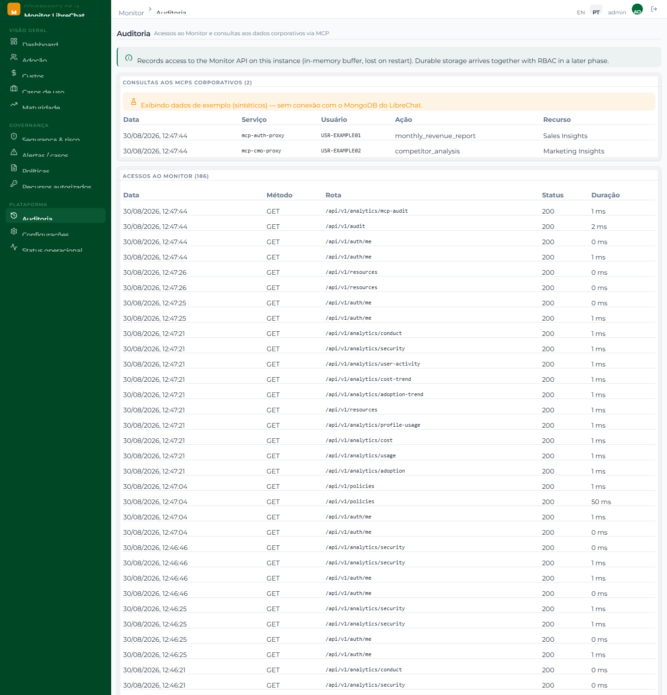
_Consultas MCP corporativas e o histórico de acesso do próprio Monitor — método, rota,
status e duração de cada chamada._

> O histórico de acesso ao Monitor fica em memória — some quando o serviço reinicia.
> Persistência de longo prazo entra junto com um controle de acesso mais granular,
> ainda não implementado nesta versão.

## 14. Configurações

Uma referência do que está configurado hoje, e de como o controle de acesso por papel
vai funcionar quando estiver pronto — por enquanto, documental.

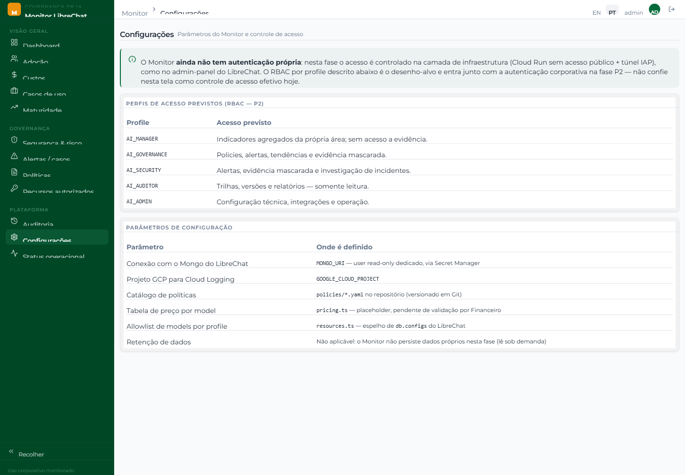
_Papéis de acesso planejados (RBAC) e de onde vem cada parâmetro do sistema._

Nesta versão, o Monitor tem um único login compartilhado — sem perfis de acesso
diferenciados. O desenho de RBAC (Role-Based Access Control) mostrado aqui é o alvo
para quando a autenticação própria for implementada; não confie nesta tela como
controle de acesso efetivo hoje.

## 15. Status Operacional

A saúde do próprio Monitor: está conectado ao MongoDB? os dados batem com o formato
esperado? quais integrações opcionais estão ligadas?

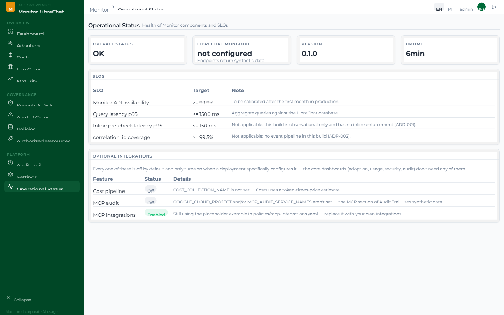
_Status geral, conexão com o MongoDB, metas de disponibilidade (SLOs) e o painel de
integrações opcionais._

Esta é a tela mais útil para quem está configurando o Monitor pela primeira vez — ela
responde sozinha "o que vai funcionar com o meu ambiente" sem precisar ler nenhum
arquivo de configuração. Ver a próxima seção para o detalhe de cada integração
opcional.

## 16. Integrações opcionais

O Monitor foi feito para funcionar com dados reais contra qualquer instância do
LibreChat, sem configuração além da conexão com o banco. Três recursos, porém, são
opcionais — vêm desligados por padrão e só se ligam quando alguém os configura
explicitamente:

| Recurso                         | Desligado (padrão)                                    | Ligado                                               |
| ------------------------------- | ----------------------------------------------------- | ---------------------------------------------------- |
| **Pipeline de custo**           | Custos usa uma estimativa token × preço               | Custos usa uma coleção de custo externa, já rateada  |
| **Auditoria de MCP**            | A seção MCP da Auditoria mostra dados de exemplo      | Lê o histórico real das integrações MCP configuradas |
| **Catálogo de integrações MCP** | Nenhuma integração cadastrada em Recursos Autorizados | Mostra as integrações e quais papéis podem usá-las   |

Nenhum dos três exige alterar código — são arquivos de configuração e variáveis de
ambiente. Ver o [manual técnico](TECHNICAL_MANUAL.pt-BR.md) para a configuração exata.

## 17. Perguntas frequentes

**Os números que estou vendo são reais?**
Se aparecer o aviso amarelo "Exibindo dados de exemplo (sintéticos)", não — é uma
demonstração, sem conexão com o MongoDB do LibreChat. Sem esse aviso, os números são
reais.

**Por que o custo mudou de forma diferente entre dois acessos?**
Confira se a tela de Custos está no modo "estimativa" ou "pipeline verificado" (seção 6) — os dois usam fontes diferentes e não são diretamente comparáveis período a período
se a configuração mudou no meio do caminho.

**Posso usar o Monitor para bloquear um usuário ou um prompt?**
Não. O Monitor é observacional em todas as suas telas — ele nunca intercepta nem impede
uma conversa. Qualquer ação de bloqueio precisa acontecer na configuração do próprio
LibreChat.

**Esqueci a senha de acesso ao Monitor.**
Fale com quem administra o ambiente — a redefinição de senha é feita fora do painel,
diretamente na configuração do serviço.

---

_Manual do usuário — edição em português. Idealizado por **Uelington Silva**. Apoio:
**Dimep Sistemas**._
