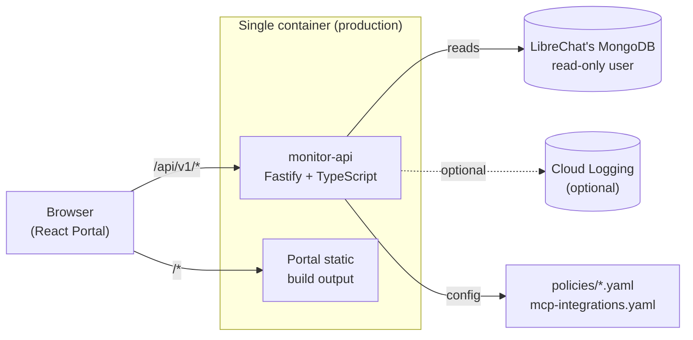

# Monitor LibreChat — Technical Documentation

_🇧🇷 [Versão em português](TECHNICAL_MANUAL.pt-BR.md) · 📘 [User manual](MANUAL.md)_

Architecture, stack, configuration, features, and operations for whoever installs,
configures, integrates, or maintains the system.

**2** services (API + Portal) · **1** production container · **58** automated tests ·
**0** required cloud dependency

## Contents

1. [Architecture](#1-architecture)
2. [Technology](#2-technology)
3. [Data model](#3-data-model)
4. [Configuration](#4-configuration)
5. [Technical features](#5-technical-features)
6. [API reference](#6-api-reference)
7. [Security](#7-security)
8. [Deployment](#8-deployment)
9. [Quality and testing](#9-quality-and-testing)
10. [Extensibility](#10-extensibility)
11. [Open-source governance](#11-open-source-governance)

## 1. Architecture

Two services inside one monorepo, packaged as **a single container** in production —
the API serves the Portal's built static files from the same origin, so the browser
never needs CORS or a second authentication boundary.



### Repository layout

```
apps/monitor-api/       API (Fastify + TypeScript) — reads Mongo read-only + platform logs
apps/monitor-portal/    Portal (React + Vite + TypeScript + Tailwind) — dashboards, EN/pt-BR
packages/shared/        TypeScript types shared between the API and the portal
policies/               Detection policy catalog + MCP integrations config (YAML)
docs/adr/               Architecture Decision Records
.github/workflows/      CI (lint, format, build, test)
```

### Architecture decisions (ADRs)

Three structural decisions are recorded as ADRs, not just as a code comment:

- **ADR-001** — Separate repository from LibreChat's own deployment configuration —
  removes any temptation to patch the chat's core or fork.
- **ADR-002** — Direct MongoDB reads, no event bus or data warehouse at this stage —
  complexity proportionate to scale.
- **ADR-003** — Runs on the same VM/host as LibreChat, same Docker network — the
  database publishes no port, and this is how it stays that way.

## 2. Technology

### Backend — apps/monitor-api

| Component | Version | Role |
|---|---|---|
| Node.js | `20` | Runtime (see `.nvmrc`) |
| Fastify | `^4.28` | HTTP server |
| TypeScript | `^5.5` | Language, `strict` mode |
| mongodb (native driver) | `^6.9` | MongoDB access — no ORM |
| @fastify/cookie | `^9.4` | Signed session cookie |
| @fastify/static | `^7.0` | Serves the built Portal |
| @google-cloud/logging | `^11.2` | MCP audit (optional) |
| yaml | `^2.5` | Parses the policy catalog and MCP integrations file |
| Vitest | `^2.1` | Tests |

### Frontend — apps/monitor-portal

| Component | Version | Role |
|---|---|---|
| React | `^18.3` | UI |
| Vite | `^5.4` | Build and dev server |
| Tailwind CSS | `^3.4` | Utility-first styling |
| Recharts | `^3.10` | Charts (bar, radar, line) |
| react-i18next / i18next | `^17` / `^26` | Internationalization (EN / pt-BR) |
| react-router-dom | `^6.26` | Client-side routing |
| lucide-react | `^1.31` | Icons |

### Monorepo tooling

ESLint (flat config) + Prettier for linting and formatting; `npm workspaces` manage the
three packages (`packages/shared`, `apps/monitor-api`, `apps/monitor-portal`) with a
single root-level `npm ci`; GitHub Actions for CI.

## 3. Data model

The Monitor doesn't define its own operational schema — it reads LibreChat's native
schema, and only that, so the core works against any deployment.

| Collection (LibreChat) | How the Monitor uses it |
|---|---|
| `users` | Each user's role (`role`) — a free-form string, not a fixed list. Adoption, Costs, and the Dashboard derive the existing roles dynamically from here. |
| `transactions` | Token consumption. `tokenType` has three possible values (`prompt`, `completion`, `credits`) — `credits` is a budget top-up, not consumption, and is always filtered out. |
| `conversations` | Conversation volume and the Agent used (`agent_id`). |
| `agents` | Names of configured corporate Agents. |
| `configs` | Model allowlist by role (`overrides.modelSpecs`) — read live, never mirrored. |
| `sessions` / `files` | Last access and generated-file counts. |

> A dedicated module (`schema-guard.ts`) checks in real time whether these collections
> still have the fields the code expects, and surfaces any drift on the Operational
> Status screen — never blocking anything. See section 5.

### Synthetic data as a safety net

Every read function follows the same pattern: with no Mongo connection, it returns
clearly-marked example data (`synthetic: true`) instead of failing. That's what lets the
Portal be developed and demoed without needing access to a real LibreChat instance.

## 4. Configuration

Everything is configured through environment variables — no sensitive value lives in
code. The table below is the complete reference.

| Variable | Required | Default | Effect |
|---|---|---|---|
| `PORT` | no | `4000` | API's HTTP port |
| `MONGO_URI` | no | — | Without it, every endpoint returns synthetic data |
| `MONGO_DB` | no | `LibreChat` | Database name |
| `ADMIN_USER` | no | `admin` | Portal login username |
| `ADMIN_PASSWORD_HASH` | **yes** | — | scrypt hash (`scrypt:salt:hash`) — without it, login never succeeds, by design |
| `SESSION_SECRET` | recommended | randomly generated | Without it, sessions don't survive a service restart |
| `COOKIE_SECURE` | no | `true` | Turn off only for local development (http) |
| `POLICIES_DIR` | no | `../../policies` | Directory holding the policy catalog and `mcp-integrations.yaml` |
| `PORTAL_DIR` | no | — | When set, the API also serves the built Portal (single-container architecture) |
| `GOOGLE_CLOUD_PROJECT` | no | — | Required for MCP audit via Cloud Logging |
| `MCP_AUDIT_SERVICE_NAMES` | no | — | Comma-separated service names to audit (together with the variable above) |
| `COST_COLLECTION_NAME` | no | — | Name of an external, already-apportioned cost collection; without it, Costs uses a token-based estimate |

> The password hash uses `:` as a separator, not `$` — on purpose. Docker Compose
> interpolates variables inside `.env` values, and a hash containing `$` arrives
> truncated at the container.

## 5. Technical features

### Graceful cost fallback

The Costs screen has two possible sources, chosen at request time: if
`COST_COLLECTION_NAME` points at a collection that actually exists in the database, the
Monitor uses that verified cost; otherwise, it computes an estimate from the same token
counts the Usage screen already reads, priced by an internal table (`pricing.ts`). The
API response always identifies which source was used (`source: "aggregate-collection" |
"estimate"`) — it never claims to be verified when it's actually an estimate.

### Schema verification and onboarding report

`schema-guard.ts` plays two roles: (1) it compares LibreChat's native collections
against the fields the queries assume, flagging drift without ever blocking anything;
(2) it feeds the "Optional integrations" panel on the Operational Status screen, which
answers — with no need to read any config file — whether the cost pipeline, MCP audit,
and MCP integrations catalog are active, and why.

### Graceful connection degradation

The MongoDB connection uses a short timeout (`serverSelectionTimeoutMS: 5000`) and a
10-second backoff window after a failure — without this, each of the roughly 10 polling
calls per minute would attempt a fresh reconnect while the database was down, stacking
slow attempts instead of failing fast into synthetic mode.

### File-based configuration, not code

Two extension points live in YAML, versioned in Git, and never require a rebuild:

| File | Controls |
|---|---|
| `policies/*.yaml` | The detection policy catalog shown on the Policies screen |
| `policies/mcp-integrations.yaml` | Which MCP integrations exist and which roles may use them (Authorized Resources) |

### Internationalization

The Portal uses `react-i18next` with automatic namespace discovery via
`import.meta.glob` — adding a new language is just creating the JSON files under
`locales/<language>/`, with nothing to register in code. A test (`keys.test.ts`)
guarantees EN and pt-BR always define exactly the same set of keys.

## 6. API reference

Every endpoint (except `/health` and `/ready`) sits under the `/api/v1` prefix and
requires an authenticated session.

| Method | Route | Returns |
|---|---|---|
| POST | `/auth/login` | Authenticates and starts a session |
| POST | `/auth/logout` | Ends the session |
| GET | `/auth/me` | Current session's user |
| GET | `/analytics/adoption` | DAU/WAU/MAU, activation rate, adoption by role |
| GET | `/analytics/adoption-trend` | Daily active-users series |
| GET | `/analytics/usage` | Tokens, prompts, conversations, by model and Agent |
| GET | `/analytics/cost` | Total cost and cost by role/model/area |
| GET | `/analytics/cost-trend` | Daily cost series |
| GET | `/analytics/profile-usage` | Usage profile normalized by role (Dashboard's radar chart) |
| GET | `/analytics/conduct` | Statistical consumption-deviation signal (z-score) |
| GET | `/analytics/user-activity` | User list with last access |
| GET | `/analytics/security` | Security detections for the period |
| GET | `/analytics/mcp-audit` | MCP integration usage audit |
| GET | `/resources` | Allowlist by role, Agents, and MCP integrations |
| GET | `/policies` | Full policy catalog |
| GET | `/audit` | Access trail for the Monitor itself |
| GET | `/status` | Health, SLOs, schema check, and optional-integration status |
| GET | `/health` | Liveness check (no prefix, no auth) |

## 7. Security

| | |
|---|---|
| **Authentication** | A single shared user per instance (no RBAC in this version), password stored as an scrypt hash, never in plain text. |
| **Session** | httpOnly cookie signed with HMAC, expires after 8 hours, `Secure` enabled by default. |
| **Rate limiting** | Per IP — throttles repeated login attempts before refusing new ones for a few minutes. |
| **CORS** | Disabled — the API only serves the Portal from the same origin, so there's no legitimate cross-origin caller. |
| **Mongo access** | Dedicated, read-only user. The Monitor never writes to LibreChat's database. |
| **Content detection** | Local deterministic regex — no conversation content is ever sent to a language model for this analysis, and evidence is always masked before it reaches the screen. |

> Confirm LibreChat's MongoDB is actually running with authentication (`--auth`)
> enabled before creating the Monitor's read-only user — without that, any container on
> the same Docker network has unrestricted access to every conversation.

## 8. Deployment

Single-service architecture: one multi-stage `Dockerfile` builds the monorepo's three
packages and packages the API plus the built Portal into one image.

```dockerfile
# build
FROM node:20-slim AS build
WORKDIR /repo
COPY package.json package-lock.json ./
RUN npm ci
COPY . .
RUN npm run build --workspace=@monitor-librechat/shared \
 && npm run build --workspace=@monitor-librechat/monitor-api \
 && npm run build --workspace=@monitor-librechat/monitor-portal

# runtime
FROM node:20-slim
ENV PORTAL_DIR=/app/portal POLICIES_DIR=/app/policies
COPY --from=build /repo/apps/monitor-api/dist ./dist
COPY --from=build /repo/apps/monitor-portal/dist ./portal
CMD ["node", "dist/index.js"]
```

### Example deployment (GCP)

The README includes a full example using Compute Engine + an IAP tunnel: the container
runs on the same VM/host as LibreChat, on the same Docker network as the database,
bound to `127.0.0.1` — no new port exposed. It's an example, not a requirement: the
architecture works on any host that runs Docker.

### Continuous integration

Every push and pull request runs, in this order, via GitHub Actions: `npm ci` → `npm
run lint` → `npx prettier --check .` → `npm run build` → `npm test`. The same four
steps can be run locally before opening a PR.

> `.gitattributes` normalizes the whole repository to LF line endings — closing off,
> for good, a real incident where a `.sh` script with CRLF endings broke its shebang
> once it reached a Linux host.

## 9. Quality and testing

**58 automated tests** (43 in the API, 15 in the Portal), running on Vitest — none of
them depend on a real MongoDB.

- **Regression guards** — Real bugs that already happened (a field silently renamed, a
  tokenType left unfiltered) become a test that provably fails when the bug comes back.
- **Fake database** — Logic that depends on Mongo is tested against an object
  implementing only the methods actually used — no infrastructure required.
- **i18n parity** — A dedicated test guarantees no translation key exists in one
  language and is missing in the other.

Before any release, this project's own practice has been: a clean build from `npm ci`
(not just `npm install`), the full test suite, lint, and a format check — and, whenever
a change touches a screen, actually navigating it in both languages. Automated tests
prove the code compiles and the logic holds; they don't, on their own, prove a screen
works.

## 10. Extensibility

What changes through configuration, with no code touched, versus what's a recorded
architecture decision.

| Extension point | How |
|---|---|
| User roles | No configuration — read dynamically from `users.role` |
| Detection policies | Edit `policies/*.yaml` |
| MCP integrations and role visibility | Edit `policies/mcp-integrations.yaml` |
| Cost source | `COST_COLLECTION_NAME` environment variable |
| MCP audit | `GOOGLE_CLOUD_PROJECT` + `MCP_AUDIT_SERVICE_NAMES` variables |
| Interface language | New file under `locales/<language>/` |

Decisions that require changing code — policy enforcement, role-based access control
inside the Monitor itself, an event pipeline — are deliberately out of the current
scope, and documented as an ADR or as "documentational" state on the relevant screen,
not hidden.

## 11. Open-source governance

The project follows standard open-source practice, independent of LibreChat.

- **MIT license**, with no affiliation to the LibreChat project or its maintainers.
- **CONTRIBUTING.md** — development setup, code style, and the i18n key-parity rule CI
  enforces.
- **CODE_OF_CONDUCT.md** — based on the Contributor Covenant.
- **SECURITY.md** — vulnerability reports go through GitHub Security Advisories, never
  a public issue.
- **Issue and pull request templates**, with a checklist matched to this project's real
  rules (i18n parity, no secret in the diff).

---

_Technical manual — English edition. Created by **Uelington Silva**. Supported by
**Dimep Sistemas**._
