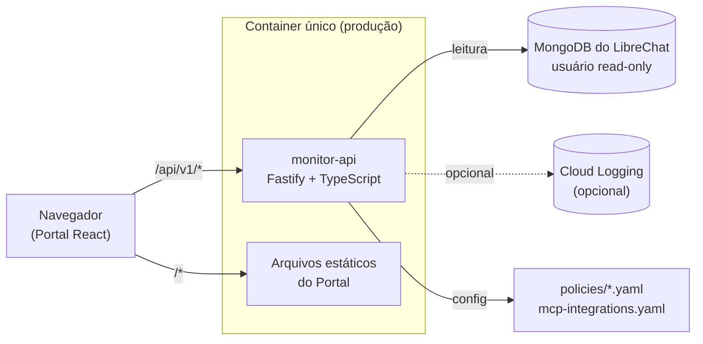

# Monitor LibreChat — Documentação Técnica

_🇺🇸 [English version](TECHNICAL_MANUAL.md) · 📘 [Manual do usuário](MANUAL.pt-BR.md)_

Arquitetura, stack, configuração, recursos e operação do painel de monitoramento — para
quem instala, configura, integra ou mantém o sistema.

**2** serviços (API + Portal) · **1** container de produção · **58** testes
automatizados · **0** dependência obrigatória de nuvem

## Sumário

1. [Arquitetura](#1-arquitetura)
2. [Tecnologia](#2-tecnologia)
3. [Modelo de dados](#3-modelo-de-dados)
4. [Configuração](#4-configuração)
5. [Recursos técnicos](#5-recursos-técnicos)
6. [Referência de API](#6-referência-de-api)
7. [Segurança](#7-segurança)
8. [Deploy](#8-deploy)
9. [Qualidade e testes](#9-qualidade-e-testes)
10. [Extensibilidade](#10-extensibilidade)
11. [Governança open source](#11-governança-open-source)

## 1. Arquitetura

Dois serviços dentro de um monorepo, empacotados como **um único container** em
produção — a API serve os arquivos estáticos do Portal na mesma origem, então o
navegador nunca precisa de CORS nem de um segundo ponto de autenticação.



### Estrutura do repositório

```
apps/monitor-api/       API (Fastify + TypeScript) — lê o Mongo (somente leitura) + logs de plataforma
apps/monitor-portal/    Portal (React + Vite + TypeScript + Tailwind) — dashboards, EN/PT-BR
packages/shared/        Tipos TypeScript compartilhados entre API e Portal
policies/               Catálogo de políticas de detecção + integrações MCP (YAML)
docs/adr/               Architecture Decision Records
.github/workflows/      CI (lint, format, build, test)
```

### Decisões de arquitetura (ADRs)

Três decisões estruturais estão registradas como ADR, não só como comentário de código:

- **ADR-001** — Repositório separado da configuração de deploy do LibreChat — evita
  qualquer tentação de alterar o fork/core do chat.
- **ADR-002** — Leitura direta do MongoDB, sem barramento de eventos nem data warehouse
  nesta fase — simplicidade proporcional à escala.
- **ADR-003** — Roda na mesma VM/host do LibreChat, mesma rede docker — o banco não
  publica porta, e essa é a forma de não abrir uma.

## 2. Tecnologia

### Backend — apps/monitor-api

| Componente              | Versão  | Papel                                             |
| ----------------------- | ------- | ------------------------------------------------- |
| Node.js                 | `20`    | Runtime (ver `.nvmrc`)                            |
| Fastify                 | `^4.28` | Servidor HTTP                                     |
| TypeScript              | `^5.5`  | Linguagem, modo `strict`                          |
| mongodb (driver nativo) | `^6.9`  | Acesso ao MongoDB — sem ORM                       |
| @fastify/cookie         | `^9.4`  | Cookie de sessão assinado                         |
| @fastify/static         | `^7.0`  | Serve o Portal buildado                           |
| @google-cloud/logging   | `^11.2` | Auditoria MCP (opcional)                          |
| yaml                    | `^2.5`  | Parser do catálogo de políticas e integrações MCP |
| Vitest                  | `^2.1`  | Testes                                            |

### Frontend — apps/monitor-portal

| Componente              | Versão        | Papel                            |
| ----------------------- | ------------- | -------------------------------- |
| React                   | `^18.3`       | UI                               |
| Vite                    | `^5.4`        | Build e dev server               |
| Tailwind CSS            | `^3.4`        | Estilização utilitária           |
| Recharts                | `^3.10`       | Gráficos (barras, radar, linha)  |
| react-i18next / i18next | `^17` / `^26` | Internacionalização (EN / PT-BR) |
| react-router-dom        | `^6.26`       | Roteamento client-side           |
| lucide-react            | `^1.31`       | Ícones                           |

### Ferramental do monorepo

ESLint (flat config) + Prettier para lint e formatação; `npm workspaces` para gerenciar
os 3 pacotes (`packages/shared`, `apps/monitor-api`, `apps/monitor-portal`) com um único
`npm ci` na raiz; GitHub Actions para CI.

## 3. Modelo de dados

O Monitor não define seu próprio schema de dados operacionais — ele lê o schema nativo
do LibreChat, e só isso, para o núcleo funcionar com qualquer instância.

| Coleção (LibreChat)  | Uso pelo Monitor                                                                                                                                                    |
| -------------------- | ------------------------------------------------------------------------------------------------------------------------------------------------------------------- |
| `users`              | Papel (`role`) de cada usuário — string livre, não uma lista fixa. Adoção, Custos e o Dashboard derivam os papéis existentes dinamicamente a partir daqui.          |
| `transactions`       | Consumo de tokens. `tokenType` tem três valores possíveis (`prompt`, `completion`, `credits`) — `credits` é recarga de orçamento, não consumo, e é sempre filtrado. |
| `conversations`      | Volume de conversas e o Agent usado (`agent_id`).                                                                                                                   |
| `agents`             | Nome dos Agents corporativos configurados.                                                                                                                          |
| `configs`            | Allowlist de modelos por papel (`overrides.modelSpecs`) — lida ao vivo, nunca espelhada.                                                                            |
| `sessions` / `files` | Último acesso e contagem de arquivos gerados.                                                                                                                       |

> Um módulo próprio (`schema-guard.ts`) verifica em tempo real se essas coleções ainda
> têm os campos que o código espera, e sinaliza qualquer divergência na tela de Status
> Operacional — sem nunca bloquear nada. Ver seção 5.

### Dado sintético como rede de segurança

Toda função de leitura segue o mesmo padrão: sem conexão com o Mongo, devolve dados de
exemplo claramente marcados (`synthetic: true`) em vez de falhar. Isso permite
desenvolver e demonstrar o Portal sem depender de acesso a uma instância real do
LibreChat.

## 4. Configuração

Toda a configuração é feita por variáveis de ambiente — nenhum valor sensível fica no
código. A tabela abaixo é a referência completa.

| Variável                  | Obrigatória | Padrão           | Efeito                                                                                    |
| ------------------------- | ----------- | ---------------- | ----------------------------------------------------------------------------------------- |
| `PORT`                    | não         | `4000`           | Porta HTTP da API                                                                         |
| `MONGO_URI`               | não         | —                | Sem ela, todos os endpoints retornam dados sintéticos                                     |
| `MONGO_DB`                | não         | `LibreChat`      | Nome do banco                                                                             |
| `ADMIN_USER`              | não         | `admin`          | Usuário de login do painel                                                                |
| `ADMIN_PASSWORD_HASH`     | **sim**     | —                | Hash scrypt (`scrypt:salt:hash`) — sem ele, o login nunca autentica, por design           |
| `SESSION_SECRET`          | recomendado | gerado ao acaso  | Sem ele, sessões não sobrevivem a um restart do serviço                                   |
| `COOKIE_SECURE`           | não         | `true`           | Desligar só em desenvolvimento local (http)                                               |
| `POLICIES_DIR`            | não         | `../../policies` | Pasta com o catálogo de políticas e `mcp-integrations.yaml`                               |
| `PORTAL_DIR`              | não         | —                | Se definida, a API também serve o Portal buildado (arquitetura de container único)        |
| `GOOGLE_CLOUD_PROJECT`    | não         | —                | Necessária para a auditoria de MCP via Cloud Logging                                      |
| `MCP_AUDIT_SERVICE_NAMES` | não         | —                | Lista separada por vírgula dos nomes de serviço a auditar (junto com a variável acima)    |
| `COST_COLLECTION_NAME`    | não         | —                | Nome de uma coleção externa de custo já apurado; sem ela, Custos usa estimativa por token |

> O hash de senha usa `:` como separador, não `$` — de propósito. O Docker Compose
> interpola variáveis dentro de valores de `.env`, e um hash com `$` chega truncado ao
> container.

Gere o `ADMIN_PASSWORD_HASH` com o script incluído — não existe cadastro nem senha
padrão, então esse é o único jeito de produzir um valor que o Monitor aceita:

```bash
npm run hash-password -w apps/monitor-api -- "sua-senha-aqui"
```

O comando imprime só o hash — a senha em si nunca é logada ou repetida na tela. Cole a
saída em `ADMIN_PASSWORD_HASH` (variável de ambiente, `.env` ou Secret Manager).

## 5. Recursos técnicos

### Fallback gracioso de custo

A tela de Custos tem duas fontes possíveis, escolhidas em tempo de execução: se
`COST_COLLECTION_NAME` aponta para uma coleção que de fato existe no banco, o Monitor
usa esse custo verificado; caso contrário, calcula uma estimativa a partir da mesma
contagem de tokens que a tela de Uso já lê, multiplicada por uma tabela de preço
interna (`pricing.ts`). A resposta da API sempre identifica qual fonte foi usada
(`source: "aggregate-collection" | "estimate"`) — nunca finge uma verificada quando na
verdade é estimada.

### Verificação de schema e relatório de onboarding

`schema-guard.ts` faz dois papéis: (1) compara as coleções nativas do LibreChat contra
os campos que as consultas assumem, sinalizando divergência sem bloquear nada; (2)
alimenta o painel "Integrações opcionais" da tela Status Operacional, que responde, sem
precisar ler nenhum arquivo de configuração, se o pipeline de custo, a auditoria de MCP
e o catálogo de integrações MCP estão ativos — e por quê.

### Degradação graciosa de conexão

A conexão com o MongoDB usa um timeout curto (`serverSelectionTimeoutMS: 5000`) e um
período de recuo de 10 segundos após uma falha — sem isso, cada uma das ~10 chamadas de
polling por minuto tentaria reconectar do zero enquanto o banco estivesse fora,
empilhando tentativas lentas em vez de cair rápido para o modo sintético.

### Configuração via arquivo, não via código

Dois pontos de extensão vivem em YAML, versionado em Git, e não exigem recompilar nada:

| Arquivo                          | Controla                                                                          |
| -------------------------------- | --------------------------------------------------------------------------------- |
| `policies/*.yaml`                | O catálogo de políticas de detecção exibido na tela Políticas                     |
| `policies/mcp-integrations.yaml` | Quais integrações MCP existem e quais papéis podem usá-las (Recursos Autorizados) |

### Internacionalização

O Portal usa `react-i18next` com descoberta automática de namespaces via
`import.meta.glob` — adicionar um idioma novo é só criar os arquivos JSON em
`locales/<idioma>/`, sem registrar nada em código. Um teste (`keys.test.ts`) garante
que EN e PT-BR sempre tenham exatamente o mesmo conjunto de chaves.

## 6. Referência de API

Todos os endpoints (exceto `/health` e `/ready`) ficam sob o prefixo `/api/v1` e exigem
sessão autenticada.

| Método | Rota                        | Retorna                                                    |
| ------ | --------------------------- | ---------------------------------------------------------- |
| POST   | `/auth/login`               | Autentica e inicia sessão                                  |
| POST   | `/auth/logout`              | Encerra a sessão                                           |
| GET    | `/auth/me`                  | Usuário da sessão atual                                    |
| GET    | `/analytics/adoption`       | DAU/WAU/MAU, ativação, adoção por papel                    |
| GET    | `/analytics/adoption-trend` | Série diária de usuários ativos                            |
| GET    | `/analytics/usage`          | Tokens, prompts, conversas, por modelo e Agent             |
| GET    | `/analytics/cost`           | Custo total e por papel/modelo/área                        |
| GET    | `/analytics/cost-trend`     | Série diária de custo                                      |
| GET    | `/analytics/profile-usage`  | Perfil de uso normalizado por papel (radar do Dashboard)   |
| GET    | `/analytics/conduct`        | Sinal estatístico de desvio de consumo (z-score)           |
| GET    | `/analytics/user-activity`  | Lista de usuários com último acesso                        |
| GET    | `/analytics/security`       | Detecções de segurança do período                          |
| GET    | `/analytics/mcp-audit`      | Auditoria de uso das integrações MCP                       |
| GET    | `/resources`                | Allowlist por papel, Agents e integrações MCP              |
| GET    | `/policies`                 | Catálogo completo de políticas                             |
| GET    | `/audit`                    | Trilha de acesso ao próprio Monitor                        |
| GET    | `/status`                   | Saúde, SLOs, verificação de schema e integrações opcionais |
| GET    | `/health`                   | Liveness check (sem prefixo, sem autenticação)             |

## 7. Segurança

|                          |                                                                                                                                                                     |
| ------------------------ | ------------------------------------------------------------------------------------------------------------------------------------------------------------------- |
| **Autenticação**         | Um único usuário compartilhado por instância (sem RBAC nesta versão), senha em hash scrypt, nunca em texto plano.                                                   |
| **Sessão**               | Cookie httpOnly assinado por HMAC, expira em 8 horas, `Secure` habilitado por padrão.                                                                               |
| **Rate limiting**        | Por IP, limita tentativas de login consecutivas antes de recusar novas por alguns minutos.                                                                          |
| **CORS**                 | Desabilitado — a API só serve o Portal na mesma origem, não há chamador cruzado legítimo.                                                                           |
| **Acesso ao Mongo**      | Usuário dedicado, somente leitura. O Monitor nunca escreve no banco do LibreChat.                                                                                   |
| **Detecção de conteúdo** | Regex determinístico local — nenhum conteúdo de conversa é enviado a um modelo de IA para essa análise, e a evidência é sempre mascarada antes de aparecer na tela. |

> Confirme que o MongoDB do LibreChat está rodando com autenticação (`--auth`)
> habilitada antes de criar o usuário de leitura do Monitor — sem isso, qualquer
> container na mesma rede docker tem acesso irrestrito a todas as conversas.

## 8. Deploy

Arquitetura de serviço único: um `Dockerfile` multi-stage builda os três pacotes do
monorepo e empacota a API + o Portal buildado numa imagem só.

```dockerfile
# build
FROM node:20-slim AS build
WORKDIR /repo
COPY package.json package-lock.json ./
RUN npm ci
COPY . .
RUN npm run build --workspace=@monitor-librechat/shared \
 && npm run build --workspace=@monitor-librechat/monitor-api \
 && npm run build --workspace=@monitor-librechat/monitor-portal

# runtime
FROM node:20-slim
ENV PORTAL_DIR=/app/portal POLICIES_DIR=/app/policies
COPY --from=build /repo/apps/monitor-api/dist ./dist
COPY --from=build /repo/apps/monitor-portal/dist ./portal
CMD ["node", "dist/index.js"]
```

### Exemplo de implantação (GCP)

O README traz um exemplo completo usando Compute Engine + túnel IAP: o container roda
na mesma VM/host do LibreChat, na mesma rede docker do banco, com bind em
`127.0.0.1` — sem porta nova exposta. É um exemplo, não uma exigência: a arquitetura
funciona em qualquer host que rode Docker.

### Integração contínua

Todo push e pull request roda, nesta ordem, via GitHub Actions: `npm ci` → `npm run
lint` → `npx prettier --check .` → `npm run build` → `npm test`. As mesmas quatro
etapas podem ser rodadas localmente antes de abrir um PR.

> `.gitattributes` normaliza todo o repositório para quebra de linha LF — resolve de
> vez um incidente real em que um script `.sh` com CRLF quebrou o shebang ao chegar num
> host Linux.

## 9. Qualidade e testes

**58 testes automatizados** (43 na API, 15 no Portal), rodando com Vitest — nenhum
deles depende de um MongoDB real.

- **Guarda de regressão** — Bugs reais que já aconteceram (campo renomeado por engano,
  tokenType não filtrado) viram teste que comprovadamente falha com o bug de volta.
- **Banco falso** — Lógica que depende do Mongo é testada com um objeto que implementa
  só os métodos usados — sem precisar de infraestrutura.
- **Paridade de i18n** — Um teste dedicado garante que nenhuma chave de tradução existe
  num idioma e falta no outro.

Antes de qualquer entrega, a prática adotada neste projeto foi: build limpo a partir de
`npm ci` (não só `npm install`), suíte completa de testes, lint e format check — e,
quando a mudança afeta uma tela, navegar por ela de verdade em ambos os idiomas. Testes
automatizados provam que o código compila e a lógica bate; não provam sozinhos que a
tela funciona.

## 10. Extensibilidade

O que muda por configuração, sem tocar em código, versus o que é uma decisão de
arquitetura registrada.

| Ponto de extensão                        | Como                                                         |
| ---------------------------------------- | ------------------------------------------------------------ |
| Papéis/perfis de usuário                 | Nenhuma configuração — lidos dinamicamente de `users.role`   |
| Políticas de detecção                    | Editar `policies/*.yaml`                                     |
| Integrações MCP e visibilidade por papel | Editar `policies/mcp-integrations.yaml`                      |
| Fonte de custo                           | Variável de ambiente `COST_COLLECTION_NAME`                  |
| Auditoria de MCP                         | Variáveis `GOOGLE_CLOUD_PROJECT` + `MCP_AUDIT_SERVICE_NAMES` |
| Idioma da interface                      | Novo arquivo em `locales/<idioma>/`                          |

Decisões que exigem mudar código — enforcement de políticas, controle de acesso por
papel dentro do próprio Monitor, um pipeline de eventos — estão deliberadamente fora do
escopo atual e documentadas como ADR ou como estado "documental" nas telas
correspondentes, não escondidas.

## 11. Governança open source

O projeto segue práticas padrão de projeto open source, independente do LibreChat.

- **Licença MIT**, sem afiliação com o projeto LibreChat ou seus mantenedores.
- **CONTRIBUTING.md** — setup de desenvolvimento, convenções de código e a regra de
  paridade de i18n que o CI verifica.
- **CODE_OF_CONDUCT.md** — baseado no Contributor Covenant.
- **SECURITY.md** — reporte de vulnerabilidades via GitHub Security Advisories, nunca
  em issue pública.
- **Templates de issue e pull request**, com checklist alinhado às regras reais do
  projeto (paridade de i18n, sem segredo no diff).

---

_Manual técnico — versão em português. Idealizado por **Uelington Silva**. Apoio:
**Dimep Sistemas**._
